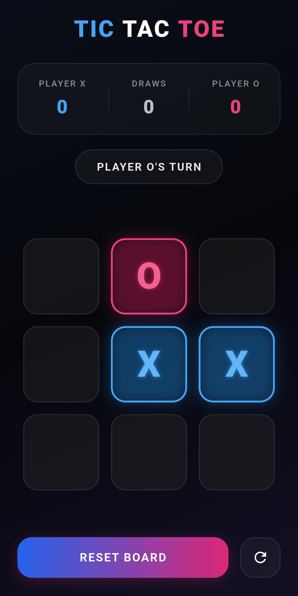

<<<<<<< HEAD
# tictactoe

A new Flutter project.

## Getting Started

This project is a starting point for a Flutter application.

A few resources to get you started if this is your first Flutter project:

- [Learn Flutter](https://docs.flutter.dev/get-started/learn-flutter)
- [Write your first Flutter app](https://docs.flutter.dev/get-started/codelab)
- [Flutter learning resources](https://docs.flutter.dev/reference/learning-resources)

For help getting started with Flutter development, view the
[online documentation](https://docs.flutter.dev/), which offers tutorials,
samples, guidance on mobile development, and a full API reference.
=======
# Tic-Tac-Toe Game

A simple Tic-Tac-Toe game built with Flutter.

## Preview



## Features

- Two-player gameplay
- Winner detection
- Draw detection
- Reset board functionality

## Tech Stack

- Flutter
- Dart

## Run Locally

```bash
flutter pub get
flutter run
```
>>>>>>> deb6809591fa4bc75e7165100dcfe57294299258
